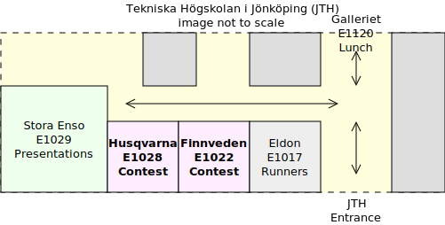
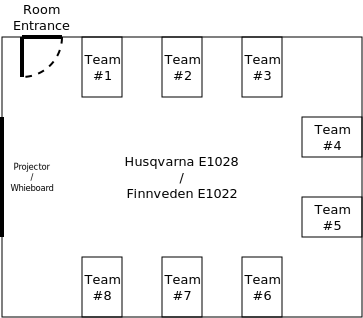

NCPC 2025 @ Jönköping University
================================

This page has
__information for those attending NCPC 2025 at the [Jönköping University][] site__.
For those attending in other sites,
please see the information on the [official NCPC 2025 website][].

## Summary

[NCPC][] is the [Nordic Collegiate Programming Contest][],
a competition involving algorithms and programming
aimed at university students.
You can find further info in [NCPC's website][].

Important information:

1. You must __[register](#registration) to participate__.
2. Note __[the schedule](#schedule-saturday-4-october-2025)__ and date:
   __Saturday, 4 October 2025__.
3. __Bring your own laptops and chargers__,
   only a table, chairs and electric sockets are provided.
4. Be mindful of the [competition rules].
5. for questions, contact the site director [Rudy Matela] <[rudy.matela@ju.se]>.

## Schedule, Saturday, 4 October 2025

| Time               | Event                        | Location                             |
| ------------------ | ---------------------------- | ------------------------------------ |
| 10:00 -- 10:15     | Recommended arrival          | [JTH (yellow building)](#jth)        |
| 10:15 -- 10:45     | Introduction Presentation    | Stora Enso E1029 Auditorium          |
| __11:00 -- 16:00__ | __Main Contest (NCPC 2025)__ | __Husqvarna E1028, Finnveden E1022__ |
| Around 12:00       | Light lunch is served        | Galleriet E1120                      |
| 16:00 -- 16:30     | Quick Award Ceremony         | Stora Enso E1029 Auditorium          |

## Registration

You must register to participate in the
[Nordic Collegiate Programming Contest][]
([NCPC 2025][]).
Registration steps:

1. find a coach (usually a lecturer from your programme).
	- JTH's CSE students: [Rudy Matela] will gladly be your coach, just email him:
	  <[rudy.matela@ju.se]>.
2. form a team of up to 3 team members, having 3 is recommended.
3. __send your coach__ the required information for all (3) team members:
	- __full name__;
	- __university email address (e.g.: `@student.ju.se`)__;
	- __a team name__ -- look at [past year for inspiration][ncpc-2024-rank].
4. coaches must follow the [registration instructions for NCPC 2025][]:
	- select Jönköping University as the site.
5. after the coach registers the team,
   team members get an email to complete their registration.

[Registration is now open](https://nordic.icpc.io/ncpc2025/compete).
Coaches can
[register at the ICPC Global website](https://icpc.global/regionals/finder/Nordic-2026).
We recommend registering by 19 September
or as early as possible to guarantee a spot.

### Arrival

After you enter [JTH](#jth) (yellow building),
turn left at the first corridor then go straight.
You'll find the Stora Enso auditorium there.

### Light lunch

Light lunch will be served (sandwiches).
There should be coffee and biscuits throughout.
You are allowed (and recommended) to bring snacks.

### JTH

Tekniska Högskolan i Jönköping, one of the four schools of Jönköping University.

### Maps

Here is a map of the rooms used in the event:

Here is how we will distribute 8 teams per room:

We will set up tables like this ideally the day before.

Again, computers will not be provided:
teams are expected to bring their own laptops.

## The NCPC

The [Nordic Collegiate Programming Contest (NCPC)][] is held every year.
Teams of 3 university students compete
solving [≈ 10 programming problems][] in 5 hours
using either C, Python, Java, C#, C++, Haskell
or one of [40 other programming languages][].
At the end,
the team with [most solved problems][] wins.
It's quite fun!  :-)

### Preparing/practicing for the NCPC

The best problems for practicing leading up to the competition
are the
[problems from NCPC 2023](https://open.kattis.com/problem-sources/Nordic%20Collegiate%20Programming%20Contest%20%28NCPC%29%202023?order=difficulty_data),
[NCPC 2022](https://open.kattis.com/problem-sources/Nordic%20Collegiate%20Programming%20Contest%20%28NCPC%29%202022?order=difficulty_data) and
[NCPC 2021](https://open.kattis.com/problem-sources/Nordic%20Collegiate%20Programming%20Contest%20%28NCPC%29%202021?order=difficulty_data)
(last years).
Here are 8 interesting problems in order of difficulty:

- [F -             FizzBuzz &nbsp; 🐝](https://open.kattis.com/problems/fizzbuzz)
- [C -     Coffee Cup Combo &nbsp; ☕](https://open.kattis.com/problems/coffeecupcombo)
- [K -       Knot Knowledge &nbsp; 🪢](https://open.kattis.com/problems/knotknowledge)
- [L -         Locust Locus &nbsp; 🦗](https://open.kattis.com/problems/locustlocus)
- [H -         Highest Hill &nbsp; ⛰️](https://open.kattis.com/problems/highesthill)
- [J -             Jamboree &nbsp; ⛺](https://open.kattis.com/problems/jamboree)
- [C -    Converting Romans &nbsp; 🏛️](https://open.kattis.com/problems/convertingromans)
- [G - Graduation Guarantee &nbsp; 🎓](https://open.kattis.com/problems/graduationguarantee)

They are [available for practice at open.kattis.com](https://open.kattis.com/problem-sources/Nordic%20Collegiate%20Programming%20Contest%20%28NCPC%29%202022?order=difficulty_data).
You can submit your solutions online there, so you can check if they are really correct.

After completing the easiest problems above, you can start solving harder problems from the past few years:
[NCPC 2024](https://open.kattis.com/problem-sources/Nordic%20Collegiate%20Programming%20Contest%20%28NCPC%29%202024?order=difficulty_data);
[NCPC 2023](https://open.kattis.com/problem-sources/Nordic%20Collegiate%20Programming%20Contest%20%28NCPC%29%202023?order=difficulty_data);
[NCPC 2022](https://open.kattis.com/problem-sources/Nordic%20Collegiate%20Programming%20Contest%20%28NCPC%29%202022?order=difficulty_data);
[NCPC 2021](https://open.kattis.com/problem-sources/Nordic%20Collegiate%20Programming%20Contest%20%28NCPC%29%202021?order=difficulty_data);
[NCPC 2020](https://open.kattis.com/problem-sources/Nordic%20Collegiate%20Programming%20Contest%20%28NCPC%29%202020?order=difficulty_data);
[NCPC 2019](https://open.kattis.com/problem-sources/Nordic%20Collegiate%20Programming%20Contest%20%28NCPC%29%202019?order=difficulty_data);
[NCPC 2018](https://open.kattis.com/problem-sources/Nordic%20Collegiate%20Programming%20Contest%20%28NCPC%29%202018?order=difficulty_data);
[NCPC 2017](https://open.kattis.com/problem-sources/Nordic%20Collegiate%20Programming%20Contest%20%28NCPC%29%202017?order=difficulty_data).

[NCPC]: https://nordic.icpc.io/
[NCPC 2025]: https://nordic.icpc.io/
[Nordic Collegiate Programming Contest (NCPC)]: https://nordic.icpc.io/
[NCPC's website]: https://nordic.icpc.io/
[official NCPC 2025 website]: https://nordic.icpc.io/
[Nordic Collegiate Programming Contest]: https://nordic.icpc.io/
[registration instructions for NCPC 2025]: https://nordic.icpc.io/ncpc2025/compete
[Jönköping University]: https://ju.se/
[Rudy Matela]: mailto:rudy.matela@ju.se
[rudy.matela@ju.se]: mailto:rudy.matela@ju.se
[competition rules]: https://nordic.icpc.io/ncpc2025/compete#rules
[ncpc-2024-rank]: https://ncpc24.kattis.com/contests/ncpc24/standings/6290
[40 other programming languages]: https://open.kattis.com/languages
[most solved problems]: https://ncpc24.kattis.com/contests/ncpc24/standings?filter=6262
[≈ 10 programming problems]: https://github.com/icpc/ncpc-web/releases/download/ncpc2022-data/ncpc2022problems.pdf
