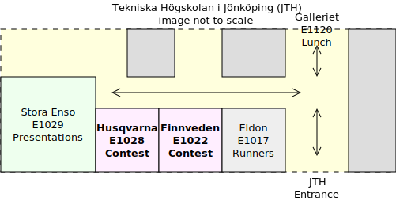

NCPC 2025 @ JU, Opening Presentation
====================================

Nordic Collegiagte Programming Contest 2025

October 4th 2025

------

Welcome to NCPC 2025 @ JU.

Thank you for coming.

Competition starts at 11:00, in a few minutes.

Here is some useful information.

------

| Time               | Event                        |
| ------------------ | ---------------------------- |
| 10:00 -- 10:15     | Recommended arrival          |
| 10:15 -- 10:45     | Introduction Presentation    |
| __11:00 -- 16:00__ | __Main Contest (NCPC 2025)__ |
| Around 12:00       | Light lunch is served        |
| 16:00 -- 16:30     | Quick Award Ceremony         |

------

## Format & Rules

------

In short:
Teams of up to three persons
try to solve as many programming problems as possible,
without external help.

------

The NCPC format:

* 👥 teams of [3 university students][]
* ⏱️ 5 hours
* 🚩 [≈ 10 programming problems][]
* ⌨️ solutions in: [Python], [C], [Java], [C#], [C++], [Haskell] or [40 other languages].
* 💻 1 computer per team
* 🎈 the team with [most problems solved][] wins

[3 university students]: https://live.staticflickr.com/7884/32596056617_5dc85ee500_b.jpg
[≈ 10 programming problems]: https://github.com/icpc/ncpc-web/releases/download/ncpc2022-data/ncpc2022problems.pdf
[Haskell]: https://www.haskell.org/
[C#]:      https://learn.microsoft.com/en-us/dotnet/csharp/
[Java]:    https://www.java.com/
[Python]:  https://www.python.org/
[C++]:     https://isocpp.org/
[C]:       https://en.wikipedia.org/wiki/C_(programming_language)
[40 other languages]: https://open.kattis.com/languages
[most problems solved]: https://ncpc24.kattis.com/contests/ncpc24/standings?filter=6262

------

Problems usually involve standard IO in the command line:

* read from the keyboard and
* write to the screen.

------

Equipment:

* __1 computer per team__ with 1 keyboard, 1 mouse and 1 screen;
* no other electronic devices such as mobile phones;
* printed material is allowed (e.g.: books).

------

What you may and may not use:

* You may __NOT__ use the internet for anything other than accessing the contest page and documentation.
* You may __NOT__ use a program using generative AI, such as Github Copilot or ChatGPT.
* You may use prewritten code, and other software available on your computer that doesn’t break the previous two rules.
* You may __NOT__ communicate with anyone other than the contest organizers and your own team members.

------

For instance:

If you are using VS Code,
please remember to disable Copilot or any extensions with Generative AI.

------

You will get a printed copy of the problem statement in a sealed envelope.

Please only open it once the competition timer starts.

------

Please review the rules here:

## [nordic.icpc.io/ncpc2025/compete](https://nordic.icpc.io/ncpc2025/compete#rules)

------

## Questions?

------

## Tips

* problems are not ordered by difficulty:
	- try to find and start with something easy
* the scoreboard shows all teams' progress:
	- look for problems that have been solved by several teams
* with 1h left, the scoreboard freezes and you can only see your own team progress
* problem scores are 0/1 (all-or-nothing):
	- try to think about edge cases if you get "wrong answer"

------

The contest uses the Kattis automatic judging system.

You should login on:

## [ncpc25.kattis.com](https://ncpc25.kattis.com)

------

## NCPC @ JU: Rooms

You'll compete in E1028 and E1022, right outside to the right.

------

------

Light __lunch__ is served at around __12:00__ on __Galleriet__.

(We'll announce in the contest rooms once it's served.)

------

I will take pictures during the competition,
to document and announce within JU that this has happened.

If you would __not__ like to appear in the pictures, please let me know.

------

| Time               | Event                        |
| ------------------ | ---------------------------- |
| 10:00 -- 10:15     | Recommended arrival          |
| 10:15 -- 10:45     | Introduction Presentation    |
| __11:00 -- 16:00__ | __Main Contest (NCPC 2025)__ |
| Around 12:00       | Light lunch is served        |
| 16:00 -- 16:20     | Quick Award Ceremony         |

After the competition ends,

please come back to __Stora Enso__ for \
the __quick award ceremony__ & group picture.

Please bring your balloons.

It'll be very __quick__ I promise...

------

## Questions?

------

__Now:__

1. Login on [ncpc25.kattis.com](https://ncpc25.kattis.com)
2. Review rules: [nordic.icpc.io/ncpc2025/compete](https://nordic.icpc.io/ncpc2025/compete#rules)
3. Move to your assigned team table in Husqvarna or Finnveden.
4. You may leave your backpacks here if you like.

Good luck!

------

.

------

NCPC 2025 @ JU, Closing Presentation
====================================

------

## Thank you for participating!

## Tack så mycket!

------

Let us take a look together at [the results](https://ncpc25.kattis.com/contests/ncpc25/standings).

1. Nordics
2. Sweden
3. JU
4. ICPC-eligible

------

Congratulations to our winning team(s)!

------

Congratulations to all of you who participated!

I hope you had fun!

------

Let's take a group picture.

Don't forget your balloons.

------

Again, thanks for coming!

I hope to see you next year.

------

.
